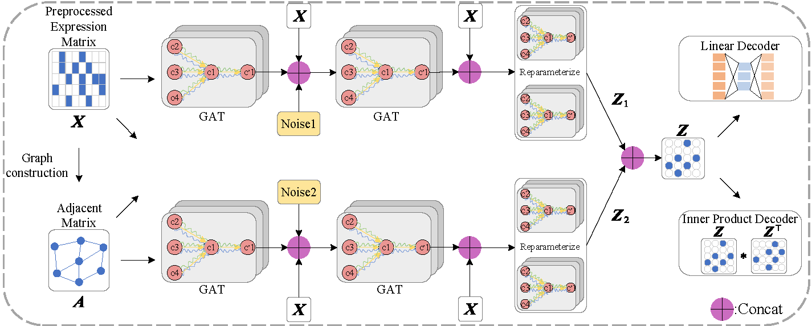

# Using multi-encoder semi-implicit graph variational autoencoder to analyze single-cell RNA sequencing data

## Overview



## Introduction

In this study, we propose a new framework called MSVGAE based on variational graph auto-encoder and graph attention networks. Specifically, we introduce multiple encoders to learn features at different scales and control for uninformative features. Moreover, different noises are added to encoders to promote the propagation of graph structural information and distribution uncertainty. Therefore, some complex posterior distributions can be captured by our model. MSVGAE maps scRNA-seq data with high dimensions and high noise into the low-dimensional latent space, which is beneficial for downstream tasks.

## Installation

To install and run this project locally, follow these steps:

### 1. Clone the repository:

```
git clone https://github.com/tswstart/MSVGAE.git
cd ./MSVGAE/
```

### 2. Create and activate a virtual environment by Anaconda:

You can set up the primary environment for MSVGAE by using the following command:

```
conda env create -f environment.yml
conda activate MSVGAE
```

## Usage
Here is a step-by-step guide on how to use the project:
### 1. Prepare Your Data

Ensure your scRNA-seq data is formatted correctly. You can use datasets from the [NCBI](https://www.ncbi.nlm.nih.gov/), [10X Genomics website](https://www.10xgenomics.com/) or your own data

### 2. **Run the Model**

 Execute the main script to perform clustering on your data.

```python
# use hdbscan
python main.py --X_path "./data/balanced/datasetName_counts.csv" --Y_path "./data/balanced/datasetName_labels.csv" --preprocess --save_graph --hdbscan --GAT
# use kmeans
python main.py --X_path "./data/balanced/datasetName_counts.csv" --Y_path "./data/balanced/datasetName_labels.csv" --preprocess --save_graph --kmeans --GAT
```

In this context, we offer a collection of commonly employed scGCC parameters for your reference. For additional details, you can execute `python main.py -h`.

**Note**: output files are saved in ./results, including `embeddings (datasetName_MSVGAE_node_embeddings.npy)`, `evaluation metrics (metric_MSVGAE.txt)`, `cluster results (pd_label_MSVGAE_dataName_counts.csv)`, `KNN graph` and some `log files (log_MSVGAE_dataName.txt)`.

## Running example

### 1. Collect Dataset.

Our sample dataset is stored in the directory "data/".

### 2. Apply scGCC

```python
python main.py --X_path "./data/imbalanced/data_-1c4_counts.csv" --Y_path "./data/imbalanced/data_-1c4_labels.csv" --preprocess --save_graph --hdbscan --GAT
```

### 3. See the results

output files are saved in ./results
